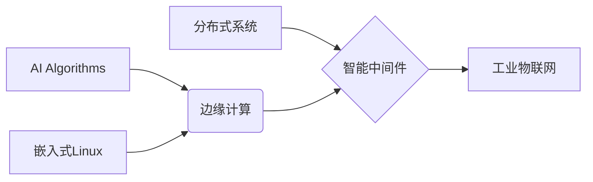

# 🚀 ExoNav Dynamics

**Next-Generation Intelligent Systems | Bridging Bits and Atoms**

Welcome to the innovation hub where artificial intelligence meets real-world systems. We specialize in creating cutting-edge solutions across multiple domains through systematic engineering practices.

## 🌟 Featured Projects

### 🤖 AI/ML 核心引擎
- **[Project Alpha](链接)** - 基于强化学习的动态路径规划框架  
  `Python` `PyTorch` `ROS` 
- **SensorFusion-Net** - 多模态传感器数据融合系统（开发中）  
  `ONNX` `C++17` `IoT`

### 🧩 智能嵌入式系统
- **[EdgeBrain](链接)** - 面向边缘计算的轻量化推理框架  
  `Rust` `ARM Cortex-M` `TinyML` 
- **AutoCalibrator** - 工业传感器自校准系统（规划中）

### 🗄️ 大数据架构
- **StreamForge** - 实时流数据处理平台  
  `Apache Flink` `Kafka` `Rust` 

## 📅 开发路线图

### 2023 Q4
- [x] EdgeBrain v1.0 发布
- [ ] Project Alpha 论文投稿
- [ ] 开源硬件参考设计发布

### 2024 Q1
- [ ] StreamForge 性能优化版
- [ ] 嵌入式AI基准测试套件
- [ ] 开发者文档中心建设

## 🛠️ 技术栈全景

## 🤝 参与贡献
我们欢迎以下形式的贡献：
- 项目原型开发
- 算法优化提案
- 硬件设计验证
- 文档翻译与改进

**协作流程：**
1. 在Issue中讨论提案
2. Fork项目仓库
3. 创建特性分支 (`git checkout -b feature/AmazingFeature`)
4. 提交Pull Request

## 📬 联系与合作
- 技术讨论：discussion@exonav.dev
- 商业合作：partner@exonav.dev
- 关注我们的[开发日志](博客链接)

## 开源哲学
> "真正的创新发生在算法与物理世界的交汇处"  
> —— ExoNav 核心信条

🛰️ 让我们共同构建智能时代的工程范式！
